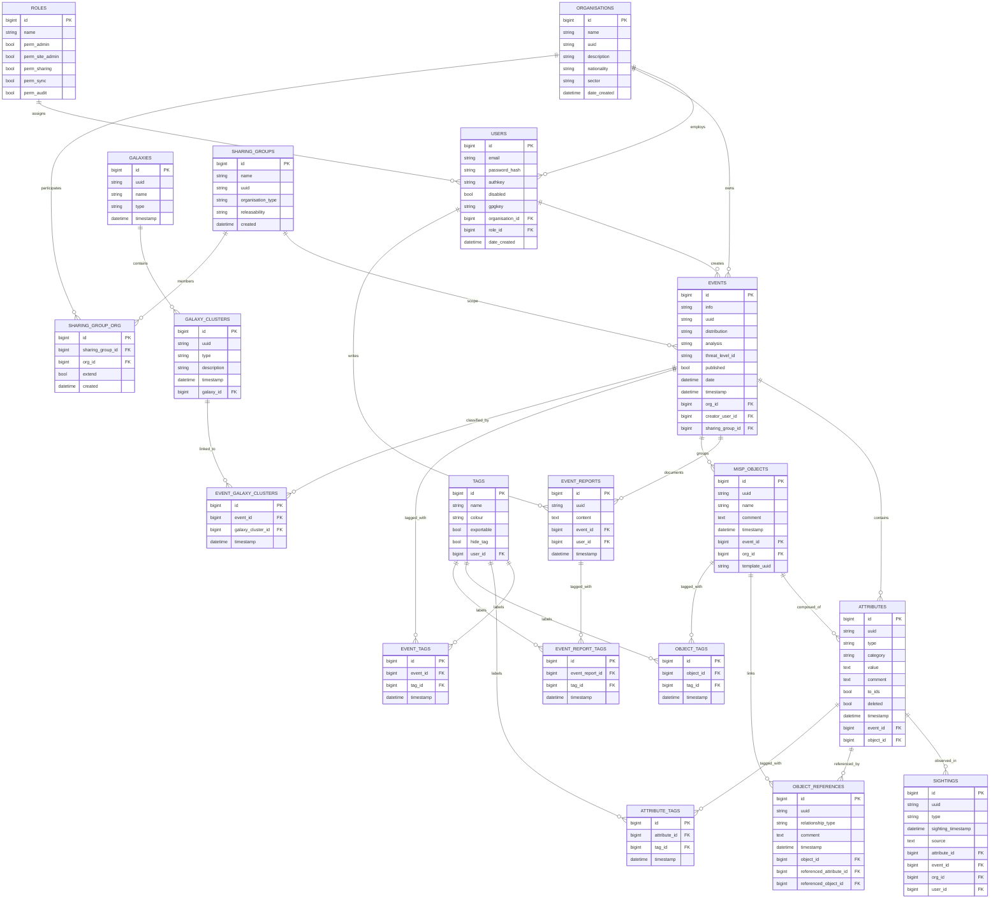

# MISP Core ER Diagram (Mermaid)

เอกสารนี้รวมแผนภาพ ER (Mermaid) ของตารางหลักใน MISP พร้อมฟิลด์สำคัญเพื่อให้มองเห็นโครงสร้างและบริบทการแชร์ข้อมูลได้ละเอียดขึ้น นำโค้ดด้านล่างไปวางที่ [mermaid.live](https://mermaid.live/edit) เพื่อเรนเดอร์แบบโต้ตอบ

## วิธีอ่านแผนภาพอย่างละเอียด
- **สี/กลุ่มใน mermaid.live:** สามารถใช้ Layout หรือจัดกลุ่ม node ด้วยตนเองเพื่อแยกโดเมน เช่น Metadata (ORG/USER/ROLE), Events, Objects, Context (Tag/Galaxy), และ Sharing
- **ฟิลด์ที่เชื่อมโยงบ่อย:** `uuid`, `org_id`, `event_id`, `object_id`, `sharing_group_id`, `timestamp` ช่วยไล่สายสัมพันธ์ของข้อมูลและการซิงก์
- **เส้นทางการสืบค้นตัวอย่าง:** เริ่มจาก `EVENTS` → `ATTRIBUTES` → `MISP_OBJECTS`/`OBJECT_REFERENCES` เพื่อดูรายละเอียดเชิงโครงสร้าง จากนั้นตามไปที่ `TAGS` หรือ `GALAXY_CLUSTERS` เพื่อวิเคราะห์บริบท และจบที่ `SHARING_GROUPS` เพื่อตรวจสอบสิทธิ์การเข้าถึง
- **ติดตามการเปลี่ยนแปลง:** ฟิลด์ `timestamp`/`created` ในหลายตารางช่วยระบุลำดับเวลา เหมาะสำหรับกระบวนการซิงก์หรือออดิตกิจกรรม

คัดลอกบล็อก Mermaid ไปเรนเดอร์บน mermaid.live เพื่อซูม, pan, และ export ภาพสำหรับใช้ในเอกสารหรือสไลด์การอบรมได้ทันที
