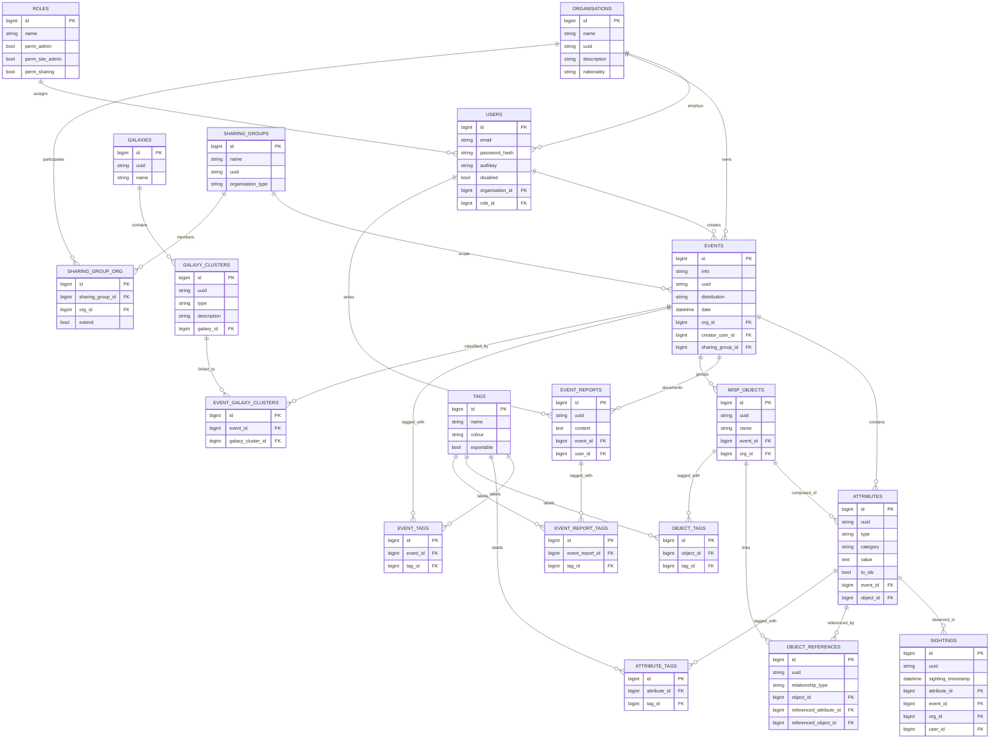

# MISP Core ER Diagram (Mermaid)

This document provides a detailed entity-relationship (ER) diagram for key parts of the MISP data model using Mermaid syntax. You can paste the code block into [mermaid.live](https://mermaid.live/edit) to view the interactive diagram.

**How to use**
1. Copy the Mermaid block above.
2. Visit [mermaid.live/edit](https://mermaid.live/edit) and paste the block into the editor.
3. The diagram is interactive: zoom, pan, and export as PNG/SVG for documentation.

The diagram focuses on common, high-traffic tables and their relationships to help understand how events, attributes, tags, and sharing controls connect across MISP.
